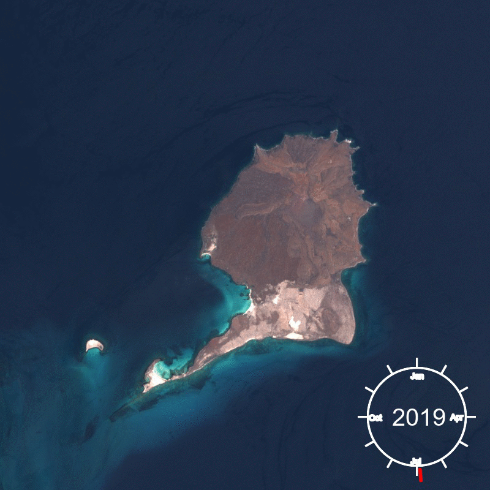
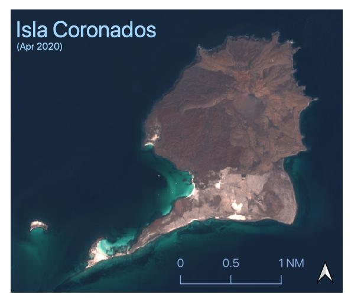

# magick-gifs
A not-very-portable way to generate gifs of Sentinel satellite images of an area.



## The problem
When creating raster maps of an area based on satellite imagery, the
specific image you use matters. As an example, the other day I was making
some maps of [Parque Nacional Bahía de
Loreto](https://en.wikipedia.org/wiki/Bah%C3%ADa_de_Loreto_National_Park).
The area is highly seasonal, with cool, wet winters and hot, dry summers.
So it makes a huge difference if you make your map with a January image...


...or one from April.



My question as a result is this: how can we effectively visualize seasonal
changes in terrain using satellite imagery?

## Requirements
### imagemagick
Install based on [imagemagick
instructions](https://imagemagick.org/script/download.php). Make sure that
`convert` is available in the command line wherever you're running the
script from. Someday, I'd love to use a python wrapper for imagemagick, but
I have been persistently unable to even install them thus far. Advice would
be much appreciated.

### Data
Get data from the [Copernicus Open Access
Hub](https://scihub.copernicus.eu/dhus/#/home). You'll have to create an
account, then search in a specified area. If you're looking to  use this
package, you'll probably want images of the same *tile* over time. As a
tile example, the islands shown in this package are in tiles RVP and RWP,
off the coast of Baja California Sur. (First rule of GIS: your area of
interest *always* bridges multiple tiles.) Thus far, I've used Sentinel 2B,
level 1C data. I don't *think* I've incorporated that assumption in the
code, but ymmv.

I recommend just downloading the true color images (TCIs), as it's faster
and that's all you need for this script. If you're already downloading the
full dataset I should note that imagemagick *does not* seem to respect
symlinks, so you'll want to either rewrite file-finding logic in the script
(hit me up with a pull request!) or actually copy the TCIs to a single
directory so the script can find them.

#### Transform the data into a format imagemagick can use...
Further augmenting my desire for a usable python wrapper...command line
imagemagick as I have it installed cannot operate on JPEG 2000 images
(`.jp2` extension), which means you'll need to do something to convert the
TCIs into normal JPEGs (the script looks for `.jpg` files). In the end, the
low-tech solution seemed to work best: open a file in Preview, save as,
change the file type to jpeg, save. YUCK.

### Pipenv
See installation instructions on the [pipenv github
page](https://github.com/pypa/pipenv)

You'll want to use `pipenv shell` in the directory with this `Pipfile` and
lock file. If you're running in an OS other than OS X, *and* an issue
arises, you may need to relock the pipenv (`pipenv lock`).


## Running the script
The script  is called `animate_islands.py`. Run it with, for instance:

```
python animate_islands.py --help
```

At the moment, I've embedded information about where islands in the
national marine park are located, pixel-wise. If I continue development,
the first thing to be added will be support for arbitrary tiles
and crop frames. For now, to generate a gif like the above, use

```
python animate_islands.py /path/to/tci/directory coronados --destination result_file.gif
```

Wait a minute as it processes and makes some expensive imagemagick calls,
then check out `result_file.gif`. Congrats, you have a gif!


